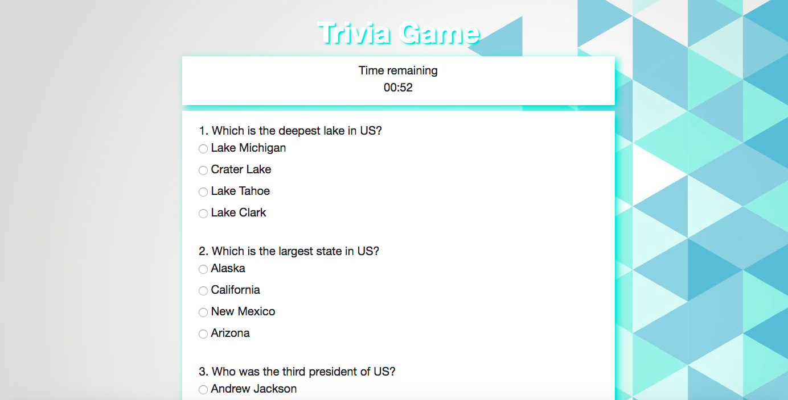

# TriviaGame

<!-- Put a description of what the project is -->
Learning jQuery: Click event handlers, setTimeOut, setInterval, dymanically creating html elements and adding them to the page

## Link to deployed site
<!-- make a link to the deployed site --> 
<!-- [What the user will see](the link to the deployed site) -->
[Trivia-Game](https://ajitas.github.io/TriviaGame/)

## Images
<!-- take a picture of the image and add it into the readme  -->
<!--  -->


## technology used
<!-- make a list of technology used -->
<!-- what you used for this web app, like html css -->

<!-- 
1. First ordered list item
2. Another item
⋅⋅* Unordered sub-list. 
1. Actual numbers don't matter, just that it's a number
⋅⋅1. Ordered sub-list
4. And another item. 
-->
1. HTML
2. CSS/BootStrap
    * grid layout
    * box-shadow
    * text-shadow
3. Javascript
    * control structure
    * data structures
    * functions
4. jQuery
    * Event Handling
    * setTimeout/ clearTimeout
    * setInterval/ clearInterval
    * Dynamically creating new html elements
    * Appending and removing dynamically created html elements to other html elements
    * Providing attributes to dynamically created html elements
    * Displaying/Hiding elements with show()/hide()


## code snippets
<!-- put snippets of code inside ``` ``` so it will look like code -->
<!-- if you want to put blockquotes use a > -->

```
//data structure
var quiz = [
    {question:"Which is the deepest lake in US?",
    options:["Lake Michigan","Crater Lake","Lake Tahoe","Lake Clark"],
    answer:"Crater Lake"},
    {question:"Which is the largest state in US?",
    options:["Alaska","California","New Mexico","Arizona"],
    answer:"Alaska"},
];
$("#start-game").on("click",function(){

    //show/hide appropriate divs
    $("#start-game").hide();
    $("#time-remaining").show();
    $("#question-area").show();
    $("#finish-game").show();
    //show timer
    $("#time-remaining").append("<p>" + timeConvert(currentTime)+"</p>");

    //start the timer
    clearInterval(updateTime);
    updateTime = setInterval(decrementTime,1000);

    //for each question
    for(var i =0; i<quiz.length;i++){

        //create a div for showing the question
        var questionDiv = $("<div>");
        questionDiv.html(i+1 + ". " +quiz[i]["question"]);
        //append the newly created question div to question-area
        $("#question-area").append(questionDiv);

        //for each of the four options
        for(var j =0; j<4 ;j++){

            //create a radio button with id=option1, option2
            var optionRadio = $("<input type='radio'>");
            optionRadio.attr("id","option"+parseInt(j+1));
            //give the radio button name of option1 for first question, option2 for second..
            optionRadio.attr("name","question"+parseInt(i+1));
            //give it the value from the option array
            optionRadio.val(quiz[i]["options"][j]);

            //craete a label and give it text from the option array
            var label = $("<label for=option"+parseInt(j+1)+">"); 
            label.text(quiz[i]["options"][j]);

            //create a new div and append radio button to it and give it the label created earlier
            var optionDiv = $("<div>");
            optionDiv.append(optionRadio);
            optionDiv.append(label);
            
            //append the new div to the question-area after the question
            $("#question-area").append(optionDiv);

        }
        $("#question-area").append("<br>");
    }
});

//evaluates the answers after player submits it or when time is up
function evaluateAnswers(){

    //stop the timer
    clearInterval(updateTime);

    //hide/show appropriate divs
    $("#evaluation-area").show();
    $("#time-remaining").hide();
    $("#question-area").hide();
    $("#finish-game").hide();

    //for each of the question
    for(var i =0; i<quiz.length;i++){

        //if the answer matches with the user input
        if(quiz[i]["answer"] ===  $("input[name=question"+parseInt(i+1)+"]:checked").val()){
            //increment the correct counter
            correct++;
        }
        //if user did not answer
        else if (!$("input[name=question"+parseInt(i+1)+"]:checked").val())
        {
            //increment the unanswered counter
            unanswered++;
        }
        //if  the answer does not match user input increment the incorrect counter
        else
        incorrect++;
    }
    //create a new div to show the evaluation
    var correctDiv = $("<div>");
    correctDiv.html("Correct Answers: " + correct);

    //create a new div to show the evaluation
    var incorrectDiv = $("<div>");
    incorrectDiv.html("Incorrect Answers: " + incorrect);

    //create a new div to show the evaluation
    var unansweredDiv = $("<div>");
    unansweredDiv.html("Unanswered: " + unanswered);

    //append the three newly created divs to result div
    $("#evaluation-area").append(correctDiv);
    $("#evaluation-area").append(incorrectDiv);
    $("#evaluation-area").append(unansweredDiv);

}
```
## Learning points
* Event Handling in jQuery
* Using setTimeout / clearTimeout
* Using setInterval / clearInterval
* Dynamically creating new html elements using jQuery
* Appending and removing dynamically created html elements to other html elements using jQuery
* Providing attributes to dynamically created html elements using jQuery
* Displaying/Hiding elements with show()/hide() jQuery


## Author 
[Ajita Srivastava](https://github.com/ajitas)

## License
Standard MIT License